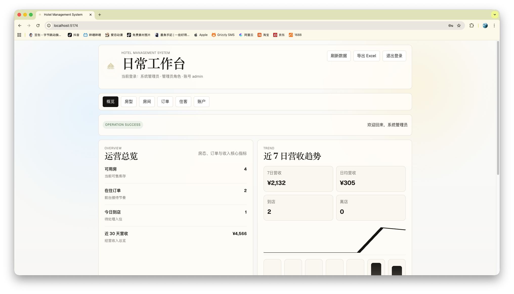
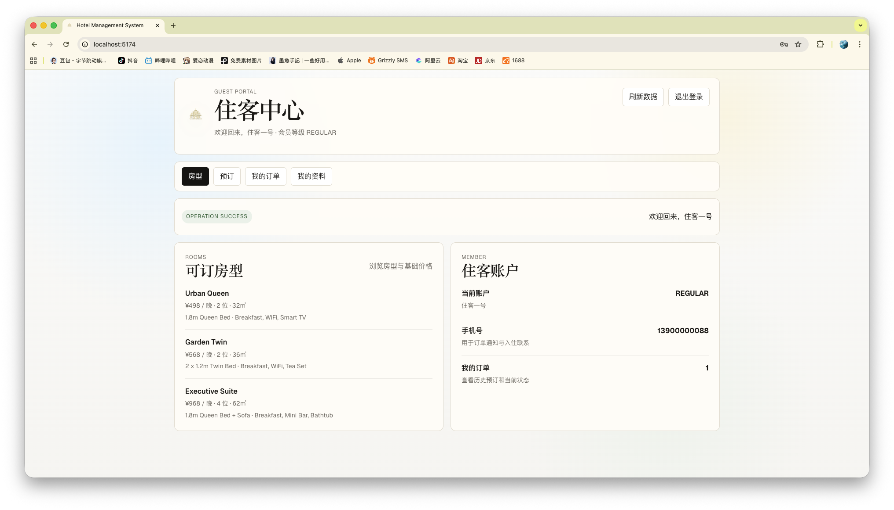

# 酒店管理平台

一个面向酒店日常运营场景的前后端分离项目，覆盖后台管理、前台接待与住客端自助预订三类角色。项目基于 `Spring Boot 3 + Spring Security + MyBatis-Plus + MySQL + Vue 3 + Vite` 构建，提供完整接口、权限模型、业务流转与极简风格前端界面，适合作为课程设计、毕业设计、全栈练手项目或中小型酒店业务原型。

## 项目亮点

- 三端角色协同：管理员、前台专员、住客端统一接入同一套平台能力
- 完整酒店业务链路：房型、房间、住客、预订、入住、离店、结算、报表
- 正式化权限控制：基于 Spring Security 与 JWT 的角色访问控制
- 订单状态流转：支持 `BOOKED / CHECKED_IN / CHECKED_OUT / CANCELLED`
- 自动计价能力：按房型单价与入住晚数自动计算订单金额
- 费用拆分更贴近日常业务：房费、早餐、加床、押金、优惠券独立核算
- 经营分析看板：概览指标、趋势图、Excel 报表导出
- 极简中后台 UI：统一信息结构、轻量视觉语言、适合演示与二次开发

## 技术架构

### 后端

- Spring Boot 3.3.5
- Spring Security
- MyBatis-Plus 3.5.8
- MySQL 8
- JWT
- Apache POI

### 前端

- Vue 3
- Vite 4
- 原生 CSS 轻量化定制界面

## 核心功能

### 1. 认证与权限

- 管理后台登录
- 住客端注册与登录
- JWT 鉴权
- 用户修改密码
- 角色区分与接口访问控制
- 支持角色：
  - `ADMIN`
  - `FRONT_DESK`
  - `CUSTOMER`

### 2. 管理后台

- 仪表盘概览
- 营收趋势分析
- Excel 报表导出
- 房型管理 CRUD
- 房间管理 CRUD
- 订单管理 CRUD
- 订单分页、筛选、搜索
- 订单状态流转
- 住客管理 CRUD
- 会员等级维护
- 入住登记与离店处理
- 订单打印单、入住单、退房结算单接口
- 管理员账户与角色维护

### 3. 订单与结算

- 按入住晚数自动计算房费
- 拆分早餐费、加床费、押金、优惠券金额
- 自动汇总订单应收金额
- 校验房间可用性与日期冲突
- 记录历史入住与消费统计

### 4. 住客端

- 住客注册
- 住客登录
- 浏览房型与基础价格
- 在线提交预订
- 查看个人订单
- 查看个人资料与会员等级

## 系统截图

### 管理员工作台



### 前台工作台


### 住客中心



## 目录结构

```text
.
├── backend                     # Spring Boot 接口服务
├── frontend                    # Vue 3 + Vite 前端
├── database                    # MySQL 初始化脚本与增量脚本
└── docs/screenshots            # README 展示截图
```

## 业务角色说明

### 管理员 `ADMIN`

- 查看运营总览与趋势分析
- 管理房型、房间、订单、住客
- 导出 Excel 报表
- 管理后台账号、角色与权限范围

### 前台专员 `FRONT_DESK`

- 查看工作台数据
- 办理入住、离店
- 管理订单与住客档案
- 辅助前厅接待与日常流转

### 住客 `CUSTOMER`

- 注册住客账号
- 查看房型
- 提交预订
- 查询个人订单与基础资料

## 快速开始

### 1. 初始化数据库

导入以下脚本：

- [database/hotel_management.sql](database/hotel_management.sql)

如果你需要按增量方式同步结构，也可以执行：

- [database/migrations/2026-04-22_reservation_charge_breakdown.sql](database/migrations/2026-04-22_reservation_charge_breakdown.sql)
- [database/migrations/2026-04-22_customer_user.sql](database/migrations/2026-04-22_customer_user.sql)

### 2. 配置数据库连接

编辑 [backend/src/main/resources/application.yml](backend/src/main/resources/application.yml)，按本地 MySQL 环境修改：

- `spring.datasource.url`
- `spring.datasource.username`
- `spring.datasource.password`

### 3. 启动后端

```bash
cd backend
mvn spring-boot:run
```

默认端口：`8080`

### 4. 启动前端

```bash
cd frontend
pnpm install
pnpm dev
```

默认地址：`http://localhost:5174`

## 默认测试账号

### 后台管理员

- 账号：`admin`
- 密码：`admin123`

### 前台专员

- 账号：`frontdesk`
- 密码：`front123`

### 住客端示例账号

- 账号：`13900000088`
- 密码：`guest123`

## 关键接口示例

### 认证接口

- `POST /api/v1/auth/login`
- `GET /api/v1/auth/me`
- `POST /api/v1/auth/change-password`
- `POST /api/v1/customer/auth/login`
- `POST /api/v1/customer/auth/register`
- `GET /api/v1/customer/auth/me`

### 仪表盘与报表

- `GET /api/v1/dashboard/overview`
- `GET /api/v1/dashboard/trends`
- `GET /api/v1/reports/operations/export`

### 房型与房间

- `GET /api/v1/room-types`
- `GET /api/v1/room-types/page`
- `POST /api/v1/room-types`
- `PUT /api/v1/room-types/{id}`
- `DELETE /api/v1/room-types/{id}`
- `GET /api/v1/rooms`
- `GET /api/v1/rooms/page`
- `GET /api/v1/rooms/available`
- `POST /api/v1/rooms`
- `PUT /api/v1/rooms/{id}`
- `DELETE /api/v1/rooms/{id}`

### 订单与住客

- `GET /api/v1/reservations/page`
- `POST /api/v1/reservations`
- `PUT /api/v1/reservations/{id}`
- `PUT /api/v1/reservations/{id}/status`
- `GET /api/v1/reservations/{id}/print`
- `GET /api/v1/reservations/{id}/check-in-slip`
- `GET /api/v1/reservations/{id}/checkout-settlement`
- `GET /api/v1/guests`
- `GET /api/v1/guests/{id}/profile`
- `POST /api/v1/guests`
- `PUT /api/v1/guests/{id}`
- `DELETE /api/v1/guests/{id}`

### 住客端

- `GET /api/v1/customer/room-types`
- `POST /api/v1/customer/reservations`
- `GET /api/v1/customer/reservations`

## 订单状态说明

- `BOOKED`：已预订
- `CHECKED_IN`：已入住
- `CHECKED_OUT`：已退房
- `CANCELLED`：已取消

支持的核心流转：

- `BOOKED -> CHECKED_IN`
- `BOOKED -> CANCELLED`
- `CHECKED_IN -> CHECKED_OUT`

## 计价规则说明

- 房费 = 房型单价 × 入住晚数
- 订单合计 = 房费 + 早餐费 + 加床费 + 押金 - 优惠券

最终金额以后端计算并落库结果为准。

## 项目适用场景

- Java 全栈课程设计
- 酒店管理系统毕业设计
- Spring Boot + Vue 前后端分离练手项目
- 业务后台管理系统原型演示

## 后续可扩展方向

- 接入 Redis 做热点缓存与会话强化
- 补充操作日志与审计记录
- 对接短信通知与邮件提醒
- 接入对象存储管理住客证件与附件
- 拆分更细粒度菜单权限与按钮权限
- 提供 Docker Compose 一键部署

## 许可说明

本项目当前更适合作为学习、演示与个人作品集项目使用，如需商用，建议补充更完整的安全、审计、监控与部署方案。
